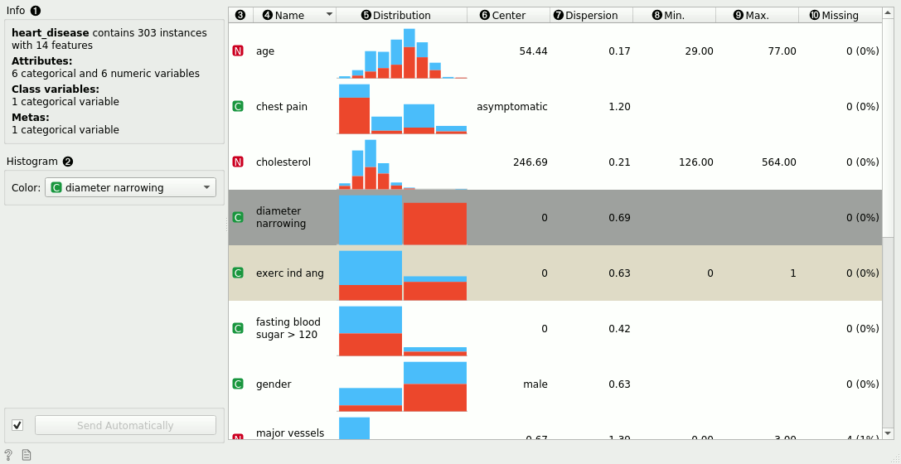
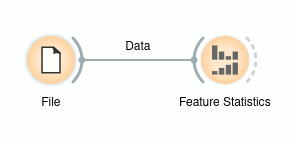
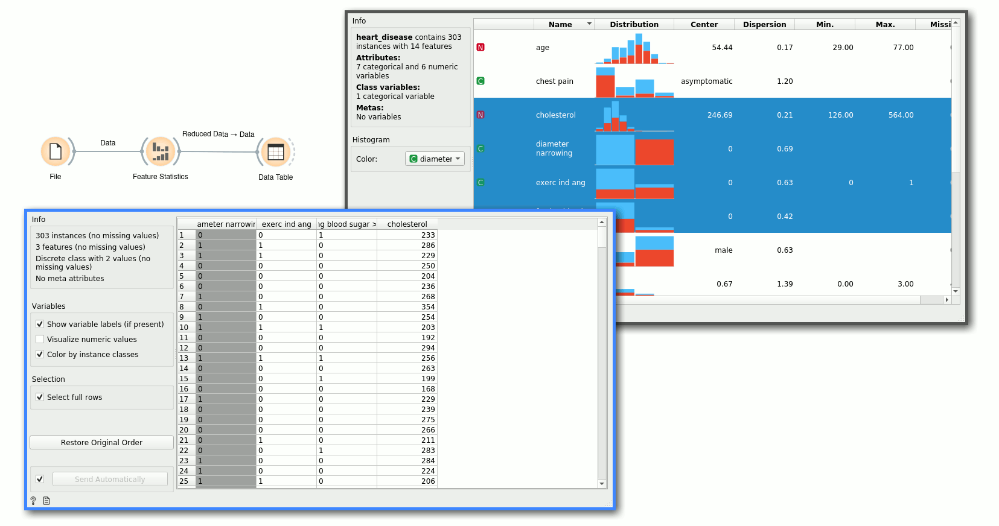
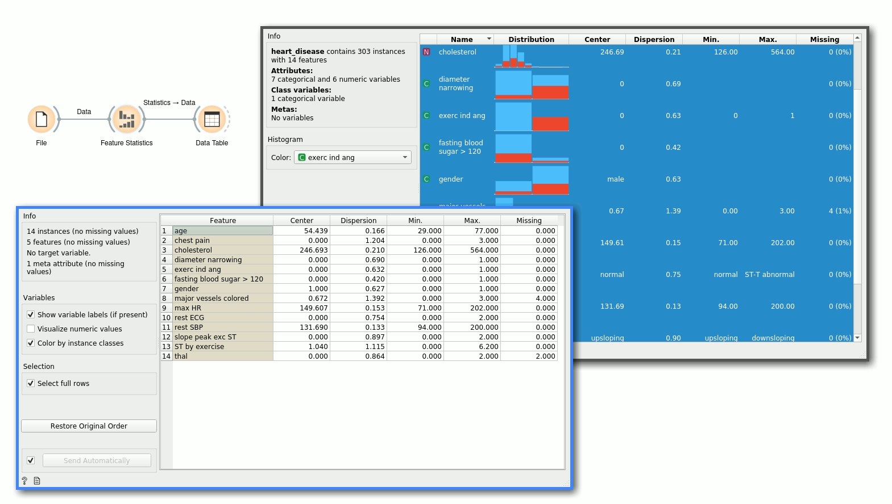

Feature Statistics
==================

Show basic statistics for data features.

**Inputs**

- Data: input data

**Outputs**
    
- Reduced data: table containing only selected features
- Statistics: table containing statistics of the selected features

The **Feature Statistics** widget provides a quick way to inspect and find interesting features in a given data set.

The Feature Statistics widget on the *heart-disease* data set. The feature *exerc ind ang* was manually changed to a meta variable for illustration purposes.

1. Info on the current data set size and number and types of features
2. The histograms on the right can be colored by any feature. If the selected feature is categorical, a discrete color palette is used (as shown in the example). If the selected feature is numerical, a continuous color palette is used. The table on the right contains statistics about each feature in the data set. The features can be sorted by each statistic, which we now describe.
3. The feature type - can be one of categorical, numeric, time and string.
4. The name of the feature.
5. A histogram of feature values. If the feature is numeric, we appropriately discretize the values into bins. If the feature is categorical, each value is assigned its own bar in the histogram.
6. The central tendency of the feature values. For categorical features, this is the [mode](https://en.wikipedia.org/wiki/Mode_(statistics)). For numeric features, this is [mean](https://en.wikipedia.org/wiki/Mean) value.
7. The dispersion of the feature values. For categorical features, this is the [entropy](https://en.wikipedia.org/wiki/Entropy_(information_theory)) of the value distribution. For numeric features, this is the [index of dispersion](https://en.wikipedia.org/wiki/Index_of_dispersion).
8. The minimum value. This is computed for numerical and ordinal categorical features.
9. The maximum value. This is computed for numerical and ordinal categorical features.
10. The number of missing values in the data.

Notice also that some rows are colored differently. White rows indicate regular features, gray rows indicate class variables and the lighter gray indicates meta variables.

Example
-------

The Feature Statistics widget is most often used after the [File](../data/file.md) widget to inspect and find potentially interesting features in the given data set. In the following examples, we use the *heart-disease* data set.

Once we have found a subset of potentially interesting features, or we have found features that we would like to exclude, we can simply select the features we want to keep. The widget outputs a new data set with only these features.

Alternatively, if we want to store feature statistics, we can use the *Statistics* output and manipulate those values as needed. In this example, we simply select all the features and display the statistics in a table.

